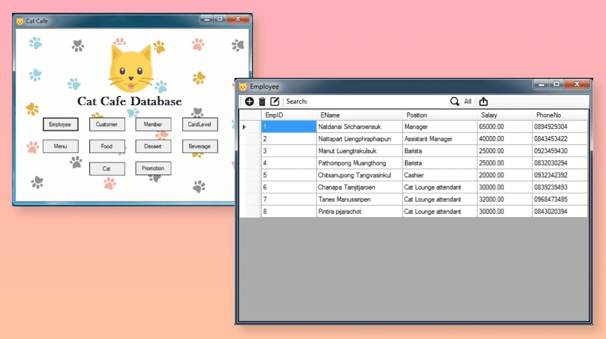

# Cat Cafe Database Application

Cat Cafe Database uses for collecting and managing data. This is my term project in Database course which I work with 5 people in my teams. I'm a programmer and project manager in this project which my main responsibilities are making a meeting every week to catch up tasks, diving work to the team and coding. We decided to use Visual Studio (IDE for coding), Microsoft SQL Server Management Studio 2014 (manage relational database) and VB.net (computer language) for the project.

### Technologies

### Description
- 